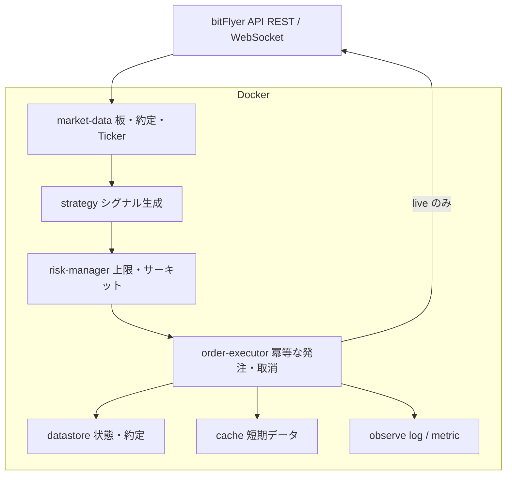
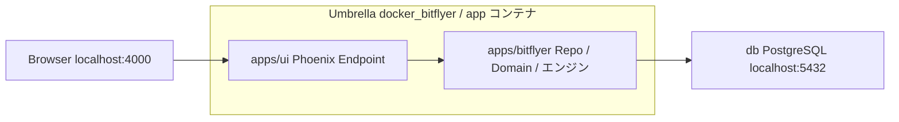

# Architecture Overview

本システムは Docker 上の複数サービスで構成し、bitFlyer Lightning API（REST / WebSocket）とやり取りする。

各サービスは単一責任に分け、発注経路には必ずリスク判定を挟む。共有状態はコンテナのメモリだけに置かず、再起動後に復元できる形で永続化する。

## 論理構成

## コンポーネント

| コンポーネント | 責務 | 止まるとどうするか |
| --- | --- | --- |
| market-data | 板・約定・Ticker を購読し、正規化して内部へ渡す | 再接続。古いデータでは発注しない |
| strategy | 市場データと状態から売買シグナルを出す | シグナル停止。既存ポジションは risk 方針に従う |
| risk-manager | サイズ、損失、頻度、価格逸脱、残高を検査する | 拒否または全停止。発注経路を閉じる |
| order-executor | 注文の送信・取消・約定確認。冪等キーを持つ | 未確定注文を API と突き合わせてから再開 |
| datastore | 注文、ポジション、残高スナップショット、設定 | 単一障害点にしない。バックアップ方針は環境別に定義 |
| cache | 短寿命の市場データやロック | 消失しても datastore と API から再構築する |
| observe | ログ、メトリクス、ヘルス、アラート | 取引は止めないが、盲目運転は禁止する |

初期実装ではプロセス数を減らし、同一リポジトリ・同一 Compose プロジェクトとして起動する。境界（データ取得 / 判断 / リスク / 発注 / 永続化）はコード上でも分ける。

## 実装スタック

論理構成は変えず、次の技術で実装する。

| 層 | 選定 |
| --- | --- |
| 言語 / ランタイム | Elixir (OTP) |
| プロジェクト形 | Mix Umbrella（アプリ名 `docker_bitflyer`） |
| 取引所連携とドメイン | `apps/bitflyer` |
| 運用 UI | `apps/ui`（Phoenix / LiveView） |
| 永続化 | Ash Framework + AshPostgres |
| DB | PostgreSQL |
| 実行基盤 | Docker Compose（サービス `app` / `db`） |

第 3 の Umbrella アプリは切らない。ペーパー取引も Discord 通知も、アプリではなく `bitflyer` 内のアダプタにする。

## アプリ境界

- `Bitflyer.Repo`（`AshPostgres.Repo`）は `apps/bitflyer` が持つ
- `ui` は `bitflyer` に依存し、Ash の公開インターフェース経由でのみデータに触る
- `ui` から bitFlyer API を直接叩かない。発注経路は risk-manager を通す
- 初期は Elixir コンテナは 1 つ。同じ BEAM でも Endpoint と取引監督は兄弟にし、UI の例外で発注側を再起動しない

論理コンポーネントの配置:

| 論理コンポーネント | 実装 |
| --- | --- |
| market-data / strategy / risk-manager / order-executor | `apps/bitflyer` |
| datastore | Ash Resource + PostgreSQL（`Bitflyer.Repo`） |
| cache | ETS（鮮度付き。単一ノードでは Redis を置かない） |
| observe（ログ・メトリクス） | `apps/bitflyer` |
| observe（画面） | `apps/ui` |

Ash は永続状態（注文、建玉、残高スナップショット、リスク停止状態、パラメータ履歴）にだけ使う。板・Ticker・判定ループは ETS または GenServer に置き、ホットパスから Resource を呼ばない。価格と数量は Decimal にする。

## 取引モード

ペーパーは `apps/paper` にしない。strategy と risk-manager はどのモードでも同じ経路を通り、切り替えるのは order-executor の出口だけにする。同じ経路を通さないペーパーは、本番で初めて壊れる。

`TRADE_MODE` で選ぶ。開発の既定は `dry_run`。`paper` と `live` は明示する。live へ切り替える操作は設定上で目立たせ、キーも混ぜない。

| モード | 約定 | 建玉・残高 | 市場データ |
| --- | --- | --- | --- |
| `dry_run` | 取引所へ出さない。擬似約定もしない。意図だけログする | 動かさない | 本番と同じ market-data でよい |
| `paper` | 取引所へ出さない。executor 内で擬似約定する | 仮想残高・建玉を datastore に書く | 同じ market-data |
| `live` | bitFlyer REST で実発注 | 取引所の事実と突合する | 同じ market-data |

`paper` の起動突合は取引所の建玉ではなく、内部の仮想状態を正とする。`dry_run` では突合で建玉を書き換えない。

## データと状態

永続化の対象は次を最低限とする。

- 内部注文 ID と取引所の注文 ID の対応
- 未約定・部分約定の注文
- 現在ポジションと平均単価
- 直近の残高スナップショット
- リスク状態（停止中かどうか、停止理由）
- 戦略パラメータの適用履歴

起動シーケンスは次で固定する。

1. 設定と秘密情報を読み込む
2. datastore から内部状態を復元する
3. bitFlyer の残高・建玉・未約定を取得して突き合わせる
4. 不整合があれば発注せず、安全側で停止または手動確認待ちにする
5. 市場データの購読を開始する
6. ヘルスチェックを Ready にする

## 発注経路

1. strategy が「買いたい / 売りたい / 閉じたい」を内部コマンドとして出す
2. risk-manager が上限と市場データの鮮度を確認する
3. 通過したコマンドだけが order-executor に届く
4. executor は内部注文 ID で冪等に送る。`dry_run` なら送らず記録のみ、`paper` なら擬似約定、`live` なら bitFlyer REST
5. 約定・拒否・取消は datastore に書き、strategy と risk に返す

strategy から API を直接叩かない。market-data の遅延や欠損があるときは、新しい注文を出さない。

## 信頼性

- コンテナは `restart: unless-stopped` 相当で自動再起動する
- ヘルスチェックは「プロセス生存」だけでなく「データ鮮度」と「取引所との同期」を見る
- WebSocket 切断時は再接続し、必要なら REST で穴埋めする
- 時計ずれは注文や署名に影響するため、ホストの時刻同期を前提にする
- グレースフルシャットダウンでは、新規発注を止め、進行中の書き込みを終えてから終了する

## セキュリティ

- API キーは環境変数またはシークレットストアから注入する。イメージや Git に埋め込まない
- 本番キーは出金権限を付けない
- 開発用キーと本番キーを混在させない
- ログにシークレット、完全なリクエスト署名、不要な個人情報を出さない

## 環境

- 開発: [env/dev.md](./env/dev.md)
- 本番: [env/prod.md](./env/prod.md)

開発と本番は同じ Compose 構造を使い、接続先・上限・秘密情報・再起動ポリシーだけを変える。
