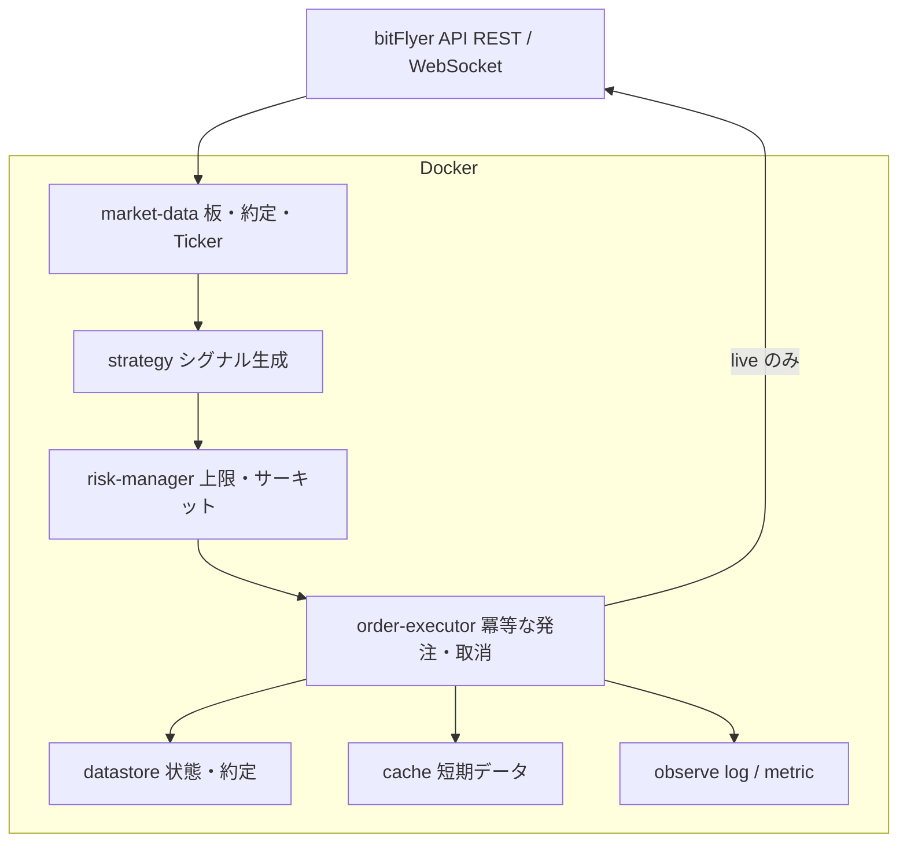
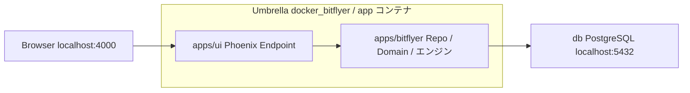

# Architecture Overview

本システムは Docker 上の複数サービスで構成し、bitFlyer Lightning API（REST / WebSocket）とやり取りする。

各サービスは単一責任に分け、発注経路には必ずリスク判定を挟む。共有状態はコンテナのメモリだけに置かず、再起動後に復元できる形で永続化する。

## 論理構成

## コンポーネント

| コンポーネント | 責務 | 止まるとどうするか |
| --- | --- | --- |
| market-data | 板・約定・Ticker を購読し、正規化して内部へ渡す | 再接続。古いデータでは発注しない |
| strategy | 市場データと状態から売買シグナルを出す | シグナル停止。既存ポジションは risk 方針に従う |
| risk-manager | サイズ、損失、頻度、価格逸脱、残高を検査する。頻度窓は再起動時に直近 Order で ETS を温める | 拒否または全停止。発注経路を閉じる |
| order-executor | 注文の送信・取消・約定確認。冪等キーを持つ | 未確定注文を API と突き合わせてから再開 |
| datastore | 注文、ポジション、残高スナップショット、設定 | 単一障害点にしない。バックアップ方針は環境別に定義 |
| cache | 短寿命の市場データやロック | 消失しても datastore と API から再構築する |
| observe | ログ、メトリクス、ヘルス、アラート | 取引は止めないが、盲目運転は禁止する |

初期実装ではプロセス数を減らし、同一リポジトリ・同一 Compose プロジェクトとして起動する。境界（データ取得 / 判断 / リスク / 発注 / 永続化）はコード上でも分ける。

## 実装スタック

論理構成は変えず、次の技術で実装する。

| 層 | 選定 |
| --- | --- |
| 言語 / ランタイム | Elixir (OTP) |
| プロジェクト形 | Mix Umbrella（アプリ名 `docker_bitflyer`） |
| 取引所連携とドメイン | `apps/bitflyer` |
| 運用 UI | `apps/ui`（Phoenix / LiveView） |
| 永続化 | Ash Framework + AshPostgres |
| DB | PostgreSQL |
| 実行基盤 | Docker Compose（サービス `app` / `db`） |

第 3 の Umbrella アプリは切らない。ペーパー取引も Discord 通知も、アプリではなく `bitflyer` 内のアダプタにする。

## アプリ境界

- `Bitflyer.Repo`（`AshPostgres.Repo`）は `apps/bitflyer` が持つ
- `ui` は `bitflyer` に依存し、Ash の公開インターフェース経由でのみデータに触る
- `ui` から bitFlyer API を直接叩かない。発注経路は risk-manager を通す
- 初期は Elixir コンテナは 1 つ。同じ BEAM でも Endpoint と取引監督は兄弟にし、UI の例外で発注側を再起動しない

論理コンポーネントの配置:

| 論理コンポーネント | 実装 |
| --- | --- |
| market-data / strategy / risk-manager / order-executor | `apps/bitflyer` |
| datastore | Ash Resource + PostgreSQL（`Bitflyer.Repo`） |
| cache | ETS（鮮度付き。単一ノードでは Redis を置かない） |
| observe（ログ・メトリクス） | `apps/bitflyer` |
| observe（画面） | `apps/ui` |
| observe（Discord 通知） | `apps/bitflyer` 内アダプタ（`Bitflyer.Observe.Discord`）。Incoming Webhook。Bot / 第3アプリは作らない |
| observe（API contract） | `Bitflyer.Observe.Contract`。公開 GET と匿名 corpus。UI は触らない。Mix は `System.contract_probe/1` |

Ash は永続状態（注文、建玉、残高スナップショット、リスク停止状態、パラメータ履歴）にだけ使う。板・Ticker・判定ループは ETS または GenServer に置き、ホットパスから Resource を呼ばない。価格と数量は Decimal にする。

## 取引モード

ペーパーは `apps/paper` にしない。strategy と risk-manager はどのモードでも同じ経路を通り、切り替えるのは order-executor の出口だけにする。同じ経路を通さないペーパーは、本番で初めて壊れる。

`TRADE_MODE` で選ぶ。開発の既定は `dry_run`。`paper` と `live` は明示する。live へ切り替える操作は設定上で目立たせ、キーも混ぜない。`TRADE_MODE=live` だけでは実発注しない。`BITFLYER_LIVE_CONFIRM`（UTC 当日の `YYYY-MM-DD`）と Ready 完了が揃うまで発注は halted。許可値以外の `TRADE_MODE` は起動時に停止する。

| モード | 約定 | 建玉・残高 | 市場データ |
| --- | --- | --- | --- |
| `dry_run` | 取引所へ出さない。擬似約定もしない。意図だけログする | 動かさない | 本番と同じ market-data でよい |
| `paper` | 取引所へ出さない。executor 内で擬似約定する | 仮想残高・建玉を datastore に書く | 同じ market-data |
| `live` | bitFlyer REST で実発注 | 取引所の事実と突合する | 同じ market-data |

`paper` の起動突合は取引所の建玉ではなく、内部の仮想状態を正とする。`dry_run` では突合で建玉を書き換えない。

live の当面の対象は **spot（既定 `BTC_JPY`）**。残高正本は `getbalance`。突合成功時、前回 tip からの amount 変化が内部 spot Fill 合計と **支払超過側** の手数料許容幅で説明できるときだけ新しい `BalanceSnapshot` を append して比較基準を前進させる。`Fill.fee`（getexecutions の `commission`）が揃っていれば quote 側に織り込み、許容は絶対床。未記録（NULL）の Fill だけ 20bps。想定より増える差分（入金）は幅内でも `balance_mismatch`。Fill が無いときの絶対床は使わない。説明不能（外部入出金など）は halt。初期 tip は承認付き `Baseline.import`、強制上書きは承認付き `--rebaseline`。`getpositions` は spot では呼ばず、内部 `Position` も建玉突合から外す（Risk 上限用の補助）。したがって **同一 API キーに残る手動 FX/CFD 建玉は監視外**（live 解禁前に口座を spot 専用にするか建玉を解消する）。FX 証拠金正本は backlog（`fx-collateral-adapter`）。

## データと状態

永続化の対象は次を最低限とする。

- 内部注文 ID と取引所の注文 ID の対応
- 未約定・部分約定の注文
- 現在ポジションと平均単価
- 直近の残高スナップショット
- リスク状態（停止中かどうか、停止理由）
- 戦略パラメータの適用履歴

起動シーケンスは次で固定する。

1. 設定と秘密情報を読み込む
2. datastore から内部状態を復元する
3. bitFlyer の残高・建玉・未約定を取得して突き合わせる
4. 不整合があれば発注せず、安全側で停止または手動確認待ちにする
5. 市場データの購読を開始する
6. ヘルスチェックを Ready にする

Ready 状態の正本は `Bitflyer.Readiness`（`:not_ready` / `:ready` / `{:halted, reason}`）。UI・executor・health は同じ状態を読む。起動直後は `:not_ready`（fail-closed）。不整合時は `halt/1` し、Ready へ直接は戻さない。

稼働 API（JSON）:

| パス | 役割 | 200 の条件 | 主な用途 |
| --- | --- | --- | --- |
| `GET /health/live` | liveness | プロセスが応答できる（常時） | Compose healthcheck / 再起動判定 |
| `GET /health/ready` | readiness | DB 可 + Readiness `:ready` +（MarketData 有効時は Feed 接続かつ全銘柄鮮度） | 外部監視。WS 断・stale を 503 で検知 |
| `GET /health` | 従来互換 | DB 可かつ halted でない（起動中 `:not_ready` 含む） | 既存ツール向け |

LiveView Socket が Endpoint で `/live` を使うため、liveness は `/health/live` とする。Compose の healthcheck は `/health/live` を見る（WS 断でコンテナ再起動しない）。盲目運転の検知は `/health/ready` を監視する。

Status UI（`:browser`）は発注可否・建玉・未約定・当日損益・halt 復帰手順を `Bitflyer.System` 経由で表示する。`UI_BASIC_AUTH_*` による BasicAuth（prod 必須）。`/health*` は認証なし。LiveView は session `:ui_basic_ok` も要求する（health 経由の匿名 session だけでは購読不可）。本番 HTTP bind の既定は `PHX_HTTP_IP=127.0.0.1`。

## 発注経路

1. strategy が「買いたい / 売りたい / 閉じたい」を内部コマンドとして出す
2. risk-manager が上限と市場データの鮮度を確認する
3. 通過したコマンドだけが order-executor に届く
4. executor は内部注文 ID で冪等に送る。`dry_run` なら送らず記録のみ、`paper` なら擬似約定、`live` なら bitFlyer REST
5. 約定・拒否・取消は datastore に書き、strategy と risk に返す

strategy から API を直接叩かない。market-data の遅延や欠損があるときは、新しい注文を出さない。

## 可観測性

- 取引ドメインの telemetry / 構造化ログ語彙の正本は `Bitflyer.Telemetry`
- イベント例: market_data tick/disconnect、risk rejected、order submitted/filled、reconcile mismatch、circuit opened、readiness changed、health unhealthy
- メタデータは allowlist のみ。秘密らしきキーは落とす
- LiveDashboard（`/ops/dashboard`）の metrics に bitflyer カウンタを載せる。Status と同じ BasicAuth。prod でも有効。Ecto / RequestLogger / OS env / 破壊操作はオフ。Processes・ETS・Applications は残る
- 本番では `Telemetry.Metrics.ConsoleReporter` を既定起動（`UI_METRICS_CONSOLE` で制御）。イベント毎に stdout へ出すが tick / Phoenix / VM は除外
- Discord 通知は observe のアダプタ（`Bitflyer.Observe.Discord`）。`DISCORD_WEBHOOK_URL`（Incoming Webhook）が有るときだけ、halt / reconcile_mismatch / disconnect と起動直後＋定期 HEARTBEAT を送る。HTTP は Task。未設定・送信失敗でも発注経路は止めない。Webhook URL はログ・メッセージ本文に出さない
- 同一ホスト死の検知は取引ホストの外。別ホストが `GET /health/ready` を pull し、ホスト exporter を scrape する（`architecture/env/prod.md`）
- 公開 API の意味論は匿名 corpus（`priv/contract/corpus`）と人手の `mix bitflyer.contract`。CI は実ホストを叩かない。手順は `architecture/env/game-day.md`

- コンテナは `restart: unless-stopped` 相当で自動再起動する
- ヘルスチェックは「プロセス生存」だけでなく「データ鮮度」と「取引所との同期」を見る
- WebSocket 切断時は再接続し、必要なら REST で穴埋めする
- 時計ずれは注文や署名に影響するため、ホストの時刻同期を前提にする。ticker `source_timestamp` とホスト壁時計の差が `max_clock_skew_ms` を超えると Risk が拒否し、live 起動突合でも halt する。`source_timestamp` 欠落も発注拒否（fail-closed）
- グレースフルシャットダウンでは、新規発注を止め、進行中の書き込みを終えてから終了する

## セキュリティ

- API キーは環境変数またはシークレットストアから注入する。イメージや Git に埋め込まない
- 名前は `BITFLYER_API_KEY` / `BITFLYER_API_SECRET` で固定。`TRADE_MODE=live` のときのみ起動時必須
- ビルドコンテキストは `.dockerignore` で `.env` / `_build` / `deps` / `.git` 等を除外する（本番 Dockerfile の `COPY` 時に混入するのを防ぐ）
- 本番キーは出金権限を付けない。live 起動時に `getpermissions` で `/v1/me/withdraw` / `/v1/me/sendcoin` が無いか検査し、あれば halt
- 開発用キーと本番キーを混在させない
- ログにシークレット、完全なリクエスト署名、不要な個人情報を出さない

## 環境

- 開発: [env/dev.md](./env/dev.md)
- 本番: [env/prod.md](./env/prod.md)
- CI / CD: [ci-cd.md](./ci-cd.md)

開発と本番は同じ Compose 構造を使い、接続先・上限・秘密情報・再起動ポリシーだけを変える。

## CI

ローカルと GitHub Actions は同じ `mix precommit` を品質ゲートにする。保証範囲・非保証・秘密情報の扱いは [ci-cd.md](./ci-cd.md) を正とする。CD（本番配布）はこの文書の対象外。
