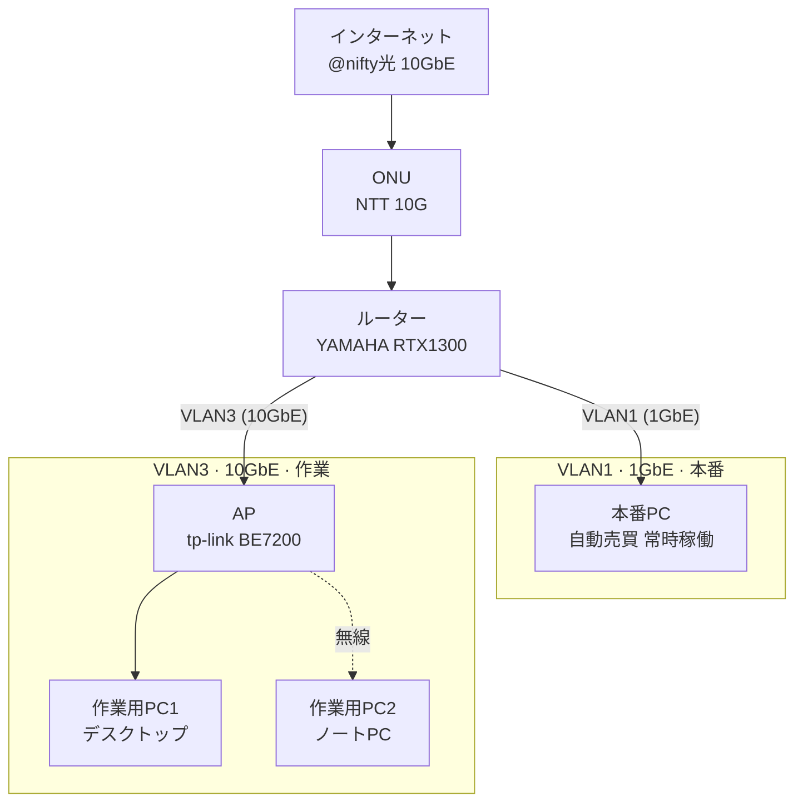
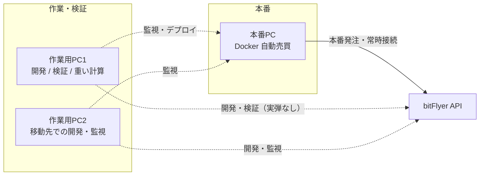

# Vision

bitFlyer Lightning 上で、Docker により **24時間365日** 稼働する自動売買システムを構築する。

人が張り付かなくても、市場データの取得・判断・発注・監視・復旧までを一貫して回し続ける。そのうえで、資金を守ることを最優先とする。

## 目的

- 指定した戦略に従い、bitFlyer の対象銘柄を自動で売買する
- 障害・再起動・一時的な API 不調のあとでも、状態を失わずに再開できる
- 開発環境では実弾を使わず検証し、本番環境では厳格な安全装置の下で稼働する

## 達成したい状態

1. `docker compose up` 相当の操作で、必要なサービス一式が立ち上がる
2. プロセスが落ちても自動再起動し、未約定・未確定の状態を安全に復元できる
3. リスク上限（ポジション、損失、発注頻度、異常値）を超えたら取引を止める
4. 何が起きているかをログ・メトリクス・アラートで後から説明できる
5. API キーなどの秘密情報はリポジトリに置かず、環境ごとに分離する

## 非目標（初期スコープ外）

- 複数取引所への同時展開
- 高度なポートフォリオ最適化や機械学習基盤そのもの
- 不特定多数向けの SaaS 化
- 裁量トレード用の高機能 UI

戦略の中身は後続のバックログで定義する。本 Vision は「止めないこと」と「壊さないこと」を先に固定する。

## 設計原則

| 原則 | 意味 |
| --- | --- |
| Safety first | 利益より、想定外の損失を止めることを優先する |
| Recoverable | いつ落ちても、永続化した状態から再開できる |
| Observable | 約定、拒否、切断、再起動の理由を残す |
| Environment split | 開発と本番で接続先・権限・上限を分ける |
| Least privilege | API キーは必要最小の権限だけを使う |
| Idempotent actions | 同じ発注意図を二重に実行しない |

## 成功の見方

- 長時間稼働しても、意図しない発注や残高の不整合が起きない
- 障害時に人が介入しなくても、安全側（取引停止または再同期）に倒れる
- 開発環境で戦略と運用手順を検証してから、本番に上げられる

## 本番環境の想定

自動売買の本番プロセスは **本番PC** 上で常時稼働させる。作業用PC は開発・検証・監視に使い、本番発注の本体にはしない。

### ネットワーク概要

| 区分 | 内容 |
| --- | --- |
| 回線 | @nifty光 10GbE |
| ONU | NTT 10G |
| ルーター | YAMAHA RTX1300 |
| VLAN1 | 1GbE · 本番PC（自動売買） |
| VLAN3 | 10GbE · tp-link BE7200（AP）経由で作業用PC |

### 役割分担

### 本番PC

| 項目 | スペック |
| --- | --- |
| CPU | Ryzen 7 5800H with Radeon Graphics |
| GPU | AMD Radeon(TM) Graphics 3G |
| RAM | 32 GB |
| ストレージ | 512 GB |
| OS | Windows 11 Pro + WSL2 |
| 接続 | VLAN1（1GbE） |

### 作業用PC1（デスクトップ）

| 項目 | スペック |
| --- | --- |
| CPU | AMD Ryzen 9 7950X 16-Core（4.50 GHz） |
| GPU | NVIDIA GeForce RTX 4090（24 GB） |
| RAM | 64 GB |
| ストレージ | C: 2 TB / D: 2 TB |
| OS | Windows 11 Pro + WSL2 |
| 接続 | VLAN3 · AP（tp-link BE7200）経由（10GbE） |

### 作業用PC2（ノートPC）

| 項目 | スペック |
| --- | --- |
| CPU | AMD Ryzen 7 8845HS w/ Radeon 780M Graphics（3.80 GHz） |
| GPU | NVIDIA GeForce RTX 4060（8 GB） |
| RAM | 32 GB |
| ストレージ | 1 TB |
| OS | Windows 11 Pro + WSL2 |
| 接続 | VLAN3 · AP 経由（無線想定） |
